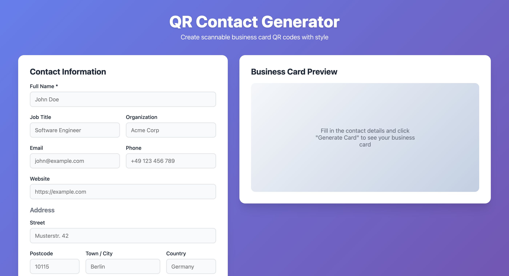

# QR Contact Generator



---

## Deutsch

Ein QR-Code-Generator fuer Visitenkarten, der komplett im Browser laeuft — **ohne Installation, ohne Server, ohne dass Daten uebertragen werden**.

### Datenschutz

Alle Kontaktdaten werden **ausschliesslich lokal im Browser** verarbeitet. Es werden **keine Daten an einen externen Server gesendet**. Die einzige Netzwerkverbindung ist der einmalige Download der QR-Code-Bibliothek (qrcode-generator) beim Laden der Seite via CDN. Die eigentliche Verarbeitung — QR-Erzeugung, Styling, Visitenkarten-Rendering — geschieht vollstaendig auf dem eigenen Geraet.

### Nutzung

1. `index.html` im Browser oeffnen (Doppelklick genuegt)
2. Kontaktdaten eingeben
3. QR-Code wird automatisch als Visitenkarte generiert
4. Mit "Download PNG" als Bilddatei speichern

Keine Installation, kein Terminal, kein Server noetig.

### Funktionen

- **7 QR-Pattern-Stile**: Standard, Rund, Diamant, Punkte, Stern, Smooth, Linien
- **Farbverlauf**: Diagonaler Farbgradient auf den QR-Modulen
- **Schatten**: Leichter Drop-Shadow unter dem QR-Code
- **Logo-Upload**: Eigenes Logo/Bild im QR-Zentrum platzieren (Drag & Drop)
- **Fehlerkorrektur**: 4 Stufen (L/M/Q/H) fuer unterschiedliche Scan-Zuverlaessigkeit
- **Visitenkarten-Layout**: QR-Code links, Kontaktdaten rechts
- **vCard 3.0**: Kompatibel mit iOS, Android, Google Contacts, Outlook
- **PNG-Export**: Hochaufloesend, druckfertig

### Dateistruktur

```
QrGenerarator/
├── index.html      # Gesamte App (HTML + CSS + JS)
├── screenshot.png   # Screenshot
└── README.md        # Diese Datei
```

---

## English

A QR code generator for business cards that runs entirely in the browser — **no installation, no server, no data transmission**.

### Privacy

All contact data is processed **exclusively in your local browser**. **No data is sent to any external server.** The only network connection is a one-time download of the QR code library (qrcode-generator) via CDN when the page loads. The actual processing — QR generation, styling, business card rendering — happens entirely on your own device.

### Usage

1. Open `index.html` in your browser (double-click is enough)
2. Enter contact details
3. The QR code is automatically generated as a business card
4. Save as image file with "Download PNG"

No installation, no terminal, no server required.

### Features

- **7 QR pattern styles**: Standard, Rounded, Diamond, Dots, Star, Smooth, Lines
- **Color gradient**: Diagonal color gradient on QR modules
- **Shadow**: Light drop shadow under the QR code
- **Logo upload**: Place your own logo/image in the QR center (drag & drop)
- **Error correction**: 4 levels (L/M/Q/H) for varying scan reliability
- **Business card layout**: QR code on the left, contact details on the right
- **vCard 3.0**: Compatible with iOS, Android, Google Contacts, Outlook
- **PNG export**: High resolution, print-ready

### File Structure

```
QrGenerarator/
├── index.html      # Complete app (HTML + CSS + JS)
├── screenshot.png   # Screenshot
└── README.md        # This file
```

---

## Italiano

Un generatore di codici QR per biglietti da visita che funziona interamente nel browser — **senza installazione, senza server, senza trasmissione di dati**.

### Privacy

Tutti i dati di contatto vengono elaborati **esclusivamente nel browser locale**. **Nessun dato viene inviato a un server esterno.** L'unica connessione di rete e il download una tantum della libreria QR (qrcode-generator) tramite CDN al caricamento della pagina. L'elaborazione effettiva — generazione QR, stile, rendering del biglietto da visita — avviene interamente sul proprio dispositivo.

### Utilizzo

1. Aprire `index.html` nel browser (basta un doppio clic)
2. Inserire i dati di contatto
3. Il codice QR viene generato automaticamente come biglietto da visita
4. Salvare come file immagine con "Download PNG"

Nessuna installazione, nessun terminale, nessun server necessario.

### Funzionalita

- **7 stili di pattern QR**: Standard, Arrotondato, Diamante, Punti, Stella, Liscio, Linee
- **Gradiente di colore**: Gradiente diagonale sui moduli QR
- **Ombra**: Leggera ombra esterna sotto il codice QR
- **Caricamento logo**: Posizionare il proprio logo/immagine al centro del QR (drag & drop)
- **Correzione errori**: 4 livelli (L/M/Q/H) per diversi gradi di affidabilita nella scansione
- **Layout biglietto da visita**: Codice QR a sinistra, dati di contatto a destra
- **vCard 3.0**: Compatibile con iOS, Android, Google Contacts, Outlook
- **Esportazione PNG**: Alta risoluzione, pronto per la stampa

### Struttura dei file

```
QrGenerarator/
├── index.html      # App completa (HTML + CSS + JS)
├── screenshot.png   # Screenshot
└── README.md        # Questo file
```

---

## License / Lizenz / Licenza

MIT License
